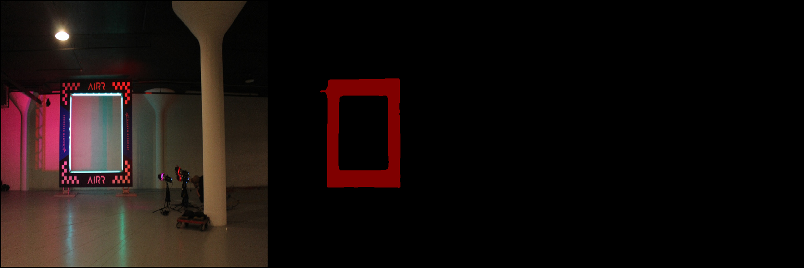

# AlphaPilot pytorch-deeplab-xception

This is the DeepLabv3+ model trained for the AlphaPilot competition.  



## Instructions to run inference

Create a test folder and extract the [Data_LeaderboardTesting](https://www.herox.com/alphapilot/resource/318) images into it:

```bash
mkdir -p data/dataset/test
cd data/dataset/test
wget https://s3.amazonaws.com/herox-alphapilot/Data_LeaderboardTesting.zip
unzip Data_LeaderboardTesting.zip
mv Data_LeaderboardTesting/* .
rm -rf Data_LeaderboardTesting
```

Download the model checkpoint from Shreeyak's [alphapilot](https://drive.google.com/drive/folders/1kWv8mx87RwPk5vDd1BM6Z9ttOPr__Pu2?usp=sharing) shared Google Drive folder. The checkpoints are saved at `alphapilot -> deeplabv3 -> <model> -> checkpoints`.

Run the inference:

```bash
python3 inference.py \
 --checkpoint_path <path/to/checkpoint/file> \
 --input_images_path "data/dataset/test/images" \
 --label_images_path <path/to/labels/if/available> \
 --result_folder <name/of/folder/to/save/results> \
 --imsize <image_size> \
```

Here's an example. Also check out `results_infer.sh` for an example script:

```bash
python3 inference.py \
 --checkpoint_path "run/run_03/models/deeplabv3plus-xception_epoch-9.pth" \
 --input_images_path "data/dataset/test/images" \
 --label_images_path "" \ # This path should be blank if labels do not exist for test set.
 --result_folder "512pos8" \
 --imsize 512 \
```

&nbsp;  
&nbsp;  

================================== ORIGINAL DEEPLAP README BELOW ==================================
### TODO
- [x] Basic deeplab v3+ model, using modified xception as backbone
- [x] Training deeplab v3+ on Pascal VOC 2012, SBD, Cityscapes datasets
- [x] Results evaluation on Pascal VOC 2012 test set
- [x] Deeplab v3+ model using resnet as backbone


### Introduction
This is a PyTorch(0.4.0) implementation of [DeepLab-V3-Plus](https://arxiv.org/pdf/1802.02611). It
can use Modified Aligned Xception and ResNet as backbone. Currently, we train DeepLab V3 Plus
using Pascal VOC 2012, SBD and Cityscapes datasets.


### Installation
The code was tested with Anaconda and Python 3.5. After installing the Anaconda environment:

0. Clone the repo:
    ```Shell
    git clone https://github.com/jfzhang95/pytorch-deeplab-xception.git
    cd pytorch-deeplab-xception
    ```

1. Install dependencies:

    For PyTorch dependency, see [pytorch.org](https://pytorch.org/) for more details.

    For custom dependencies:
    ```Shell
    pip install matplotlib pillow tensorboardX
    ```

2. Configure your dataset path in [mypath.py](https://github.com/jfzhang95/pytorch-deeplab-xception/blob/master/mypath.py).

3. You can train deeplab v3+ using xception or resnet as backbone.

    To train DeepLabV3+ on Pascal VOC 2012, please do:
    ```Shell
    python train.py
    ```

    To train it on Cityscapes, please do:
    ```Shell
    python train_cityscapes.py
    ```


